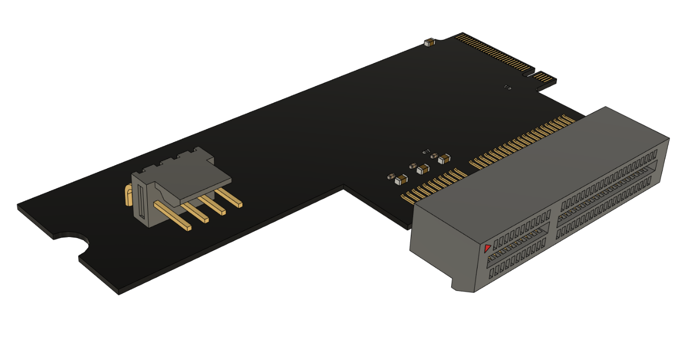
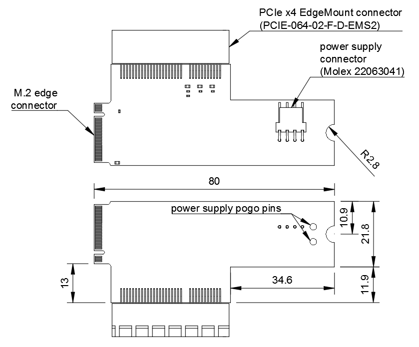

==========================
M.2 to PCIe x4 adapter card
==========================

Copyright (c) 2020 Antmicro <`www.antmicro.com <https://www.antmicro.com>`_>

Overview
========

This repository contains open hardware design files for an adapter card created to expose the Peripheral Component Interconnect Express (PCIe) signals available on the M.2 (key M) connector in a regular PCIe x4 edge card socket.
This board has been designed as an extension of the Antmicro's `Jetson Nano Baseboard <https://github.com/antmicro/jetson-nano-baseboard>`_
It allows the use of regular PCIe expansion cards and accessories with the NVIDIA `Jetson Nano <https://www.nvidia.com/en-us/autonomous-machines/embedded-systems/jetson-nano/>`_ and NVIDIA `Jetson Xavier NX <https://www.nvidia.com/en-us/autonomous-machines/embedded-systems/jetson-xavier-nx/>`_ system on modules.

Key features
============

* M.2 (key-M) edge connector
* PCIe x4 EdgeMount connector (Samtec PCIE-064-02-F-D-EMS2)
* external power supply connector (Molex 22053041)
* Nano Baseboard power supply pogo pins (Harwin P70-1000045R)

The PCB project files were prepared in KiCAD.

Board layout & dimensions
=========================

The picture below presents the general layout and dimensions of the PCB.

Getting started
===============

The PCB design does not include any active components. 
It simply passes the signals from the M.2 connector to the PCIe card edge socket.
The final thickness of the PCB should be 0.8mm to make it fit in the M.2 slots.
Since most PCIe card edge connectors are adjusted for 1.55mm, some mechanical tooling is required to assemble the PCIe socket on the PCB.

